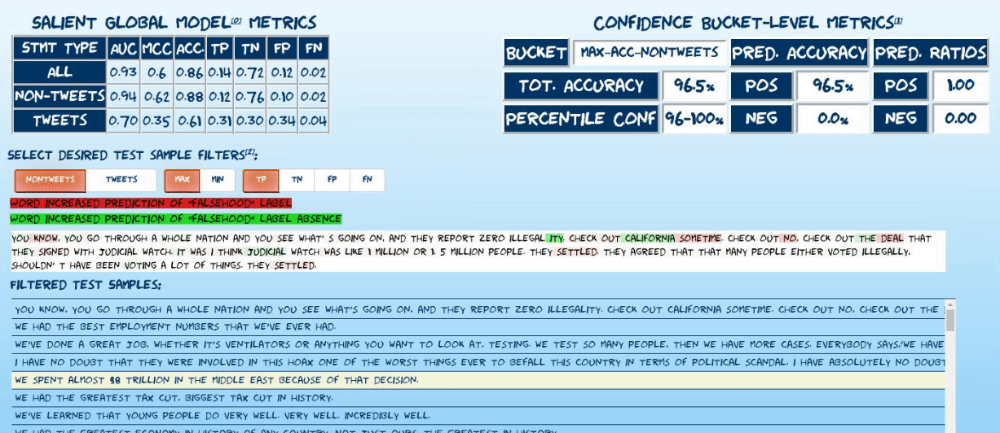
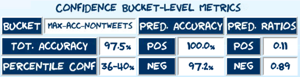
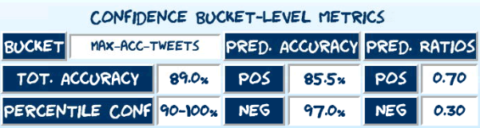
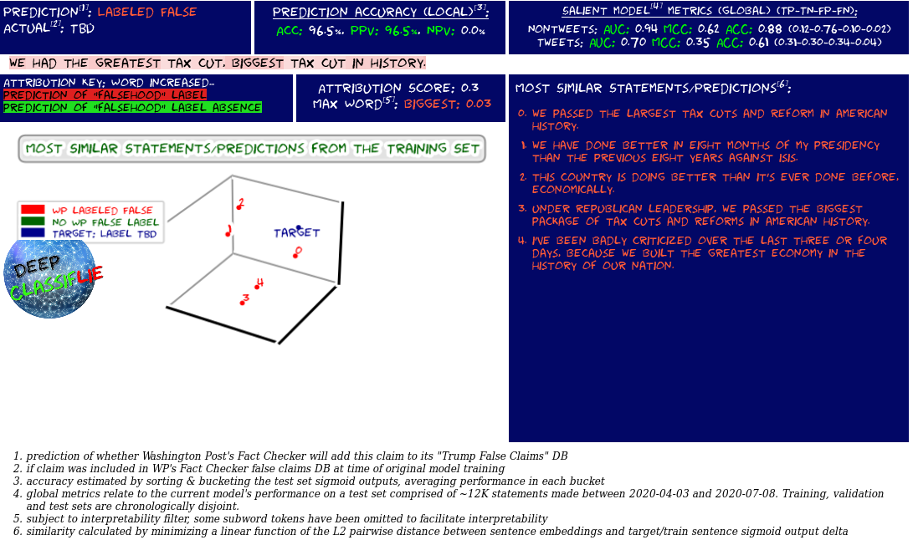
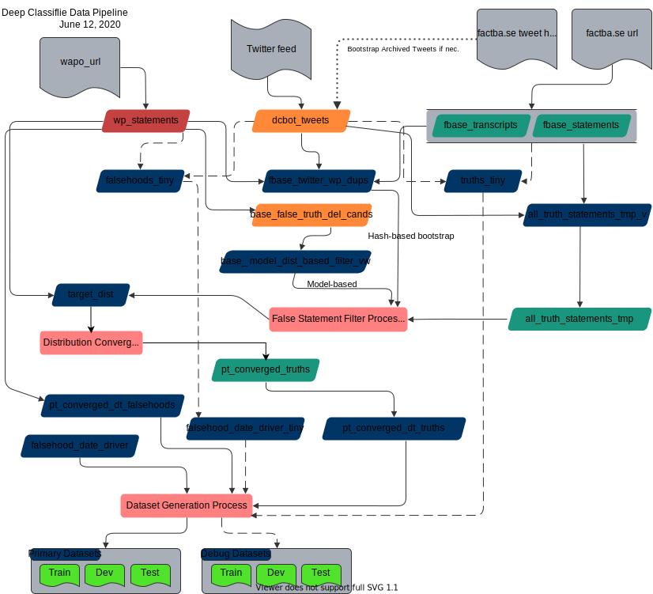
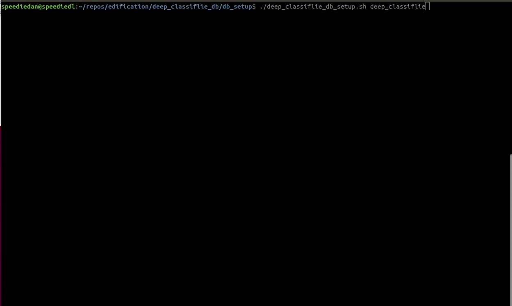

[](https://shields.io/)
[](https://shields.io/)
[](https://zenodo.org/badge/latestdoi/254935540)


<details><summary markdown="span"><strong>Table of Contents</strong>
</summary>

- [What is Deep Classiflie?](#what-is-deep-classiflie)
- [Project Motivation](#project-motivation)
- [Model Exploration](#model-exploration)
- [Core Components](#core-components)
- [Current Performance](#current-performance)
- [Noteworthy Features](#noteworthy-features)
- [Data Pipeline](#data-pipeline)
- [Configuration](#configuration)
- [Further Research](#further-research)
- [Model Replication](#model-replication)
- [Caveats](#caveats)
- [Citing Deep Classiflie](#citing-deep-classiflie)
- [References and Notes](#references-and-notes)
- [License](#license)
</details>

---
### What is Deep Classiflie?
- Deep Classiflie is a framework for developing ML models that bolster fact-checking efficiency. Predominantly a research project<sup id="ae">[e](#ce)</sup>, I plan to extend and maintain this framework in pursuing my own research interests so am sharing it in case it's of any utility to the broader community.
- As a POC, the initial alpha release of Deep Classiflie generates/analyzes a model that continuously classifies a single individual's statements (Donald Trump)<sup id="a1">[1](#f1)</sup> using a single ground truth labeling source (The Washington Post). 
- The Deep Classiflie POC model's predictions and performance on the most recent test set can be [explored](#model-exploration) and better understood using the [prediction explorer](pred_explorer.html):
    
- and the [performance explorer](perf_explorer.html):

    
    

- This research project initially integrated multiple fact-checkers and should be readily extensible to other statement streams/fact-checkers. The extent to which models built using this framework/approach generalize among different statement issuers is the next primary focus of this research project. 

---
### Project Motivation

- Asymmetries in disinformation diffusion dynamics<sup id="a0">[0](#f0)</sup> and in rates of generation vs detection suggest building tools that maximize fact-checking efficiency could be of immense societal value. To this end, Deep Classiflie can be used to build and analyze models that leverage previous fact-checking labels to enhance future fact-checking efficiency by identifying new statements most likely to be identified as falsehoods. 

- With a few [caveats](#caveats), the performance of the initial POC model built using this framework is remarkably encouraging (see [current performance](#current-performance) for more detail):
    * Global metrics (performance on the entire test set): <br/>
        
    * Local metrics (performance in a local region of confidence):<br/>
         <br/>
        

- Future research using this framework is intended to explore the extent to which these claim-classification models generalize across individuals and fact-checking entities. Approaches to sharing and integrating these models into a mutually-enhancing network are also to be investigated.

---

### Model Exploration

The best way to start understanding/exploring the current model is to use the explorers on deepclassiflie.org:

<details><summary markdown="span"><strong>Prediction Explorer</strong>
    
</summary>
    
[Explore](pred_explorer.html) randomly sampled predictions from the test set of the latest model incarnation. The explorer uses [captum's](https://captum.ai/) implementation of integrated gradients<sup id="a7">[7](#f7)</sup> to visualize attributions of statement predictions to tokens in each statement. Read more about explorer [below.](##current-performance)


</details>

<details><summary markdown="span"><strong>Performance Explorer</strong>
</summary>

[Explore](perf_explorer.html) the performance of the current model incarnation using confusion matrices oriented along temporal and confidence-based axes.


</details>

---

### Core Components

The entire initial Deep Classiflie system (raw dataset, model, analytics modules, twitter bot etc.) can be built from scratch using the publicly available code here.<sup id="a2">[2](#f2)</sup>

<div class="about-table">
    
| Component | Description |
| ---- | --- |
| [**deep_classiflie**](https://github.com/speediedan/deep_classiflie) | Core framework for building, training and analyzing fact-check facilitating ML models. Can operate independently from deep_classiflie_db when training a model using existing dataset collections or when performing inference. Depends on deep_classiflie_db for certain functions such as creating new dataset collections, running the tweetbot, running the analytics modules etc. <sup id="a3">[3](#f3)</sup> |
| [**deep_classiflie_db**](https://github.com/speediedan/deep_classiflie_db) | Backend datastore for managing Deep Classiflie metadata, analyzing Deep Classiflie intermediate datasets and orchestrating Deep Classiflie model training pipelines. Includes data scraping modules for the initial model data sources (twitter, factba.se, washington post -- politifact and the toronto star were removed from an earlier version and may be re-added among others as models for other prominent politicians are explored) |
    
</div>

<details><summary markdown="span"><strong>Dataset Generation</strong>
</summary>

- For simplicity, scrape "ground truth" falsehood labels from a single source ([Washington Post Factchecker](https://www.washingtonpost.com/graphics/politics/trump-claims-database))
- Scrape a substantial fraction of public statements from multiple sources. ([Factba.se](https://factba.se), [Twitter](https://twitter.com))
- Use statement hashes and subword representations from a base model (ALBERT<sup id="a8">[8](#f8)</sup>)  to remove "false" statements present in the larger "truths" corpus.
- Prepare chronologically disjoint train/dev/test sets (to avoid data leakage) and attempt to reduce undesired superficial class-aligned distributional artifacts that could be leveraged during model training. NNs are lazy, they'll cheat if we let them.

</details>
<details><summary markdown="span"><strong>Model Training</strong>
</summary>

- Fine-tune a base model (currently HuggingFace's [ALBERT implementation](https://huggingface.co/transformers/model_doc/albert.html) with some minor customizations) in tandem with a simple embedding reflecting the semantic shift associated with the medium via which the statement was conveyed (i.e., for the POC, just learn the tweet vs non-tweet transformation) (using [Pytorch](https://pytorch.org/))
- Explore the latest model's training session on [tensorboard.dev](https://tensorboard.dev/experiment/rGNQpYnYSOaHb2A84xRAzw). 
- N.B. neuro-symbolic methods<sup id="a6">[6](#f6)</sup> that leverage knowledge bases and integrate symbolic reasoning with connectionist methods are not used in this model. Use of these approaches may be explored in [future research](#further-research) using this framework. 
</details>
<details><summary markdown="span"><strong>Analysis & Reporting</strong>
</summary>

- Interpret statement-level predictions using [captum's](https://captum.ai/) implementation of integrated gradients to visualize attributions of statement predictions to tokens in each statement.
- Prediction and model performance exploration dashboards were built using [bokeh](https://docs.bokeh.org/en/latest/index.html) and [Jekyll](https://github.com/jekyll/jekyll)
- Two inference daemons poll, analyze and classify new statements:
    1. (still in development) A daemon that publishes via IPFS pubsub, all new statement classifications and inference output.
    2. (currently available) Automated false statement reports for predictions meeting the desired [PPV](https://en.wikipedia.org/wiki/Positive_and_negative_predictive_values) confidence threshold can be published on twitter via a twitter bot, which leverages [Tweepy](https://www.tweepy.org/). The bot <sup id="ah">[h](#ch)</sup> tweets out a statement analysis and model interpretation "report" such as the one below for statements the model deems most likely to be labeled falsehoods (see [current performance](#current-performance) for more detail):

         
- XKCD fans may notice the style of the dashboard explorers and statement reports are XKCD-inspired using the Humor Sans font created by [@ch00ftech](https://twitter.com/ch00ftech). Thanks to him (and [@xkcd](https://twitter.com/xkcd) of course!)
</details>

--- 
### Current Performance
<details><summary markdown="span"><strong>Global</strong>
</summary>
    
Global metrics<sup id="a9">[9](#f9)</sup> summarized in the table below relate to the current model's performance on a test set comprised of ~12K statements made between 2020-04-03 and 2020-07-08:<br/>


</details>

<details><summary markdown="span"><strong>Local</strong>
</summary>

To minimize false positives and maximize the model's utility, the following approach is used to issue high-confidence predictions:
    
1. All test set predictions are bucketed by model confidence (derived from the raw prediction sigmoid output).
2. Various performance metrics are calculated, grouped by confidence bucket (4%/10% of test set for non-tweets/tweets respectively). Most relevantly:
    * [PPV](https://en.wikipedia.org/wiki/Positive_and_negative_predictive_values) 
    * Positive prediction ratio: (bucket true positives + bucket false positives)/#statements in bucket
    * Bucket-level accuracy
3. Report estimated local accuracy metrics of given prediction by associating it with its corresponding confidence bucket. See [caveats](#caveats) regarding recognized performance biases<sup id="aa">[a](#ca)</sup>
    * In the prediction explorer, randomly sample 100 statements (including all confusion matrix classes) from each of four confidence buckets: the maximum and minimum accuracy buckets for each statement type.  
         <br/>
        
</details>

---
### Noteworthy Features
<details><summary markdown="span"><strong>Dataset generation</strong>
</summary>

- Easily and extensively configurable using yaml [configuration files](#configuration). 
- Multiple different class balancing strategies available (oversampling, class ratios etc.)
- "Weakly converge" superficially divergent class distributions using UnivariateDistReplicator abstraction
- Easily experiment with different train/dev/test splits/configurations via declarative DatasetCollection definitions. 
</details>

<details><summary markdown="span"><strong>Model training</strong>
</summary>
    
- Automated recursive fine-tuning of the base model with a FineTuningScheduler abstraction
- Configurable label-smoothing<sup id="a4">[4](#f4)</sup>
- Generate and configure thawing schedules for models.
- EarlyStopping easily configurable with multiple non-standard monitor metrics (e.g. mcc)
- Both automatic and manually-specified [stochastic weight averaging](https://pytorch.org/blog/stochastic-weight-averaging-in-pytorch/) of model checkpoints<sup id="af">[f](#cf)</sup>
- mixed-precision training via [apex](https://github.com/NVIDIA/apex)<sup id="ag">[g](#cg)</sup>
</details>
<details><summary markdown="span"><strong>Analysis & reporting</strong>
</summary>

- Extensive suite of reporting views for analyzing model performance and global and local levels
- Statement and performance exploration dashboards for interpreting model predictions and understanding its performance
- xkcd-themed visualization of UMAP-transformed statement embeddings
</details>

---
### Data Pipeline
To conserve resources and for POC research expediency, the current pipeline uses a local relational DB (MariaDB). Ultimately, a distributed data store would be preferable and warranted if this project merits sufficient interest from the community or a POC involving a distributed network of models is initiated. 

<details><summary markdown="span"><strong>Deep Classiflie Data Pipeline</strong>
</summary>


</details>

<details><summary markdown="span"><strong>False Statement Filter Processes</strong>
</summary>


</details>

<details><summary markdown="span"><strong>Distribution Convergence Process</strong>
</summary>


</details>

<details><summary markdown="span"><strong>Dataset Generation Process</strong>
</summary>


</details>

---
### Configuration

The parameters used in all Deep Classiflie job executions related to the development of the POC model are provided in the configs directory

<div class="about-table">
    
| Config File | Description |
| ---- | --- |
| **config_defaults.yaml** | default values and descriptions of all non-sql parameters |
| **config_defaults_sql.yaml** | default values and descriptions of all sql parameters |
| **dataprep_only.yaml** | parameters used to generate dataset |
| **train_albertbase.yaml** | parameters used to recursively train the POC model |
| **gen_swa_ckpt.yaml** | parameters used to generate an swa checkpoint (current release was built using swa torchcontrib module but will switch to the now-integrated pytorch swa api in the next release) |
| **gen_report.yaml** | parameters used to generate model analysis report(s) |
| **gen_dashboards.yaml** | parameters used to generate model analysis dashboards |
| **cust_predict.yaml** | parameters used to perform model inference on arbitrary input statements |
| **tweetbot.yaml** | parameters used to run the tweetbot behind @DeepClassiflie |

</div>

---
### Further Research

* The NLP research community is actively studying precisely what these models learn<sup id="a5">[5](#f5)</sup>. A closer examination of the distributed statement representations learned by Deep Classiflie models is planned. As of writing (2020.08.19) Google has just open-sourced an NLP model interpretability tool named [LIT](https://github.com/pair-code/lit) that one could use to further elucidate the patterns identified by Deep Classiflie models. Customizing and extending LIT for exploration of Deep Classiflie model statement representations may be warranted. 
* The extent to which these claim-classification models generalize across individuals and fact-checking entities should be explored. 
* Approaches to sharing and integrating these models into a mutually-enhancing network are also to be investigated.
    * A distributed network of fact-checking model instances each built and fine-tuned for a given salient public figure using a framework such as Deep Classiflie might allow human fact-checkers to allocate their attention more efficiently to verifying high-probability falsehoods. 
    * One can envisage a positive feedback loop developing wherein improved fact-checking coverage and latency yield increases in model-training data with the resultant improved model accuracy in turn driving further fact-checking efficiencies. The prospect of this potential value I think merits investment in research frameworks such as Deep Classiflie that attempt to explore and extend the efficacy of ML-driven enhancements to fact-checking systems.

---
### Model Replication
<details><summary markdown="span"><strong>Instructions</strong>
</summary>

N.B. before you begin, the core external dependency is admin access to a mariadb or mysql DB

1. Clone deep_classiflie and deep_classiflie_db (make them peer directories if you want to minimize configuration)
    ```shell
    git clone https://github.com/speediedan/deep_classiflie.git
    git clone https://github.com/speediedan/deep_classiflie_db.git
    ```
2. install [conda](https://docs.conda.io/projects/conda/en/latest/user-guide/install/download.html#anaconda-or-miniconda) if necessary. Then create and activate deep_classiflie virtual env:
    ```shell
    conda env create -f ./deep_classiflie/utils/deep_classiflie.yml
    conda activate deep_classiflie
    ```
3. clone captum and HuggingFace's transformers repos. Install transformers binaries.:
    ```shell
    git clone https://github.com/pytorch/captum.git
    git clone https://github.com/huggingface/transformers
    cd transformers
    pip install .
    ```
4. (temporarily required) Testing of this alpha release occurred before native AMP was integrated into Pytorch with release 1.6. As such, native apex installation is temporarily (as of 2020.08.18) required to replicate the model. Switching from the native AMP api to the pytorch integrated one is planned as part of issue #999 which should obviate the need to install native apex.
    ```shell
    git clone https://github.com/NVIDIA/apex
    cd apex
    pip uninstall apex
    pip install -v --no-cache-dir --global-option="--cpp_ext" --global-option="--cuda_ext" ./
    ```
5. [Install mariadb](https://mariadb.com/kb/en/getting-installing-and-upgrading-mariadb/) or mysql DB if necessary.
6. These are the relevant DB configuration settings used for the current release of Deep Classiflie's backend. Divergence from this configuration has not been tested and may result in unexpected behavior.
    
    ```mysql
    collation-server = utf8mb4_unicode_ci
    init-connect='SET NAMES utf8mb4'
    character-set-server = utf8mb4
    sql_mode = 'STRICT_TRANS_TABLES,ERROR_FOR_DIVISION_BY_ZERO,NO_AUTO_CREATE_USER,NO_ENGINE_SUBSTITUTION,ANSI_QUOTES'
    transaction-isolation = READ-COMMITTED
    ```
7. copy/update relevant Deep Classiflie config file to $HOME dir
    ```shell
    cp ./deep_classiflie_db/db_setup/.dc_config.example ~
    mv .dc_config.example .dc_config
    vi .dc_config
    ```

    ```shell
    # configure values appropriate to your environment and move to $HOME
    # Sorry I haven't had a chance to write a setup config script for this yet...

    export LD_LIBRARY_PATH="$LD_LIBRARY_PATH:/usr/local/cuda/lib64:/usr/local/cuda/extras/CUPTI/lib64"

    export CUDA_HOME=/usr/local/cuda
    export PYTHONPATH="${PYTHONPATH}:${HOME}/repos/edification/deep_classiflie:${HOME}/repos/captum:${HOME}/repos/transformers:${HOME}/repos/edification/deep_classiflie_db"

    export DC_BASE="$HOME/repos/edification/deep_classiflie"

    export DCDB_BASE="$HOME/repos/edification/deep_classiflie_db"
    export PYTHONUNBUFFERED=1
    export DCDB_PASS="dcbotpasshere"
    export DCDB_USER="dcbot"
    export DCDB_HOST="hostgoeshere"
    export DCDB_NAME="deep_classiflie"
    ```

8. execute Deep Classiflie DB backend initialization script:
    
    

    Ensure you have access to a DB user with administrator privs. "admin" in the case above.

    ```shell
    cd deep_classiflie_db/db_setup
    ./deep_classiflie_db_setup.sh deep_classiflie
    ```

9. login to the backend db and seed historical tweets (necessary as only most recent 3200 can currently be retrieved directly from twitter)
    ```mysql
    mysql -u dcbot -p
    use deep_classiflie
    source dcbot_tweets_init_20200814.sql
    ```

10. copy over relevant base model weights to specified model_cache_dir:
    ```shell
    # model_cache_dir default found in configs/config_defaults.yaml
    # it defaults to $HOME/datasets/model_cache/deep_classiflie/
    cd {PATH_TO_DEEP_CLASSIFLIE_BASE}/deep_classiflie/assets/
    cp albert-base-v2-pytorch_model.bin albert-base-v2-spiece.model {MODEL_CACHE_DIR}/
    ```

11. Run deep_classiflie.py with the provided config necessary to download the raw data from the relevant data sources (factba.se, twitter, washington post), execute the data processing pipeline and generate the dataset collection.
    ```shell
    cd deep_classiflie
    ./deep_classiflie.py --config "{PATH_TO_DEEP_CLASSIFLIE_BASE}/configs/dataprep_only.yaml"
    See relevant process diagrams to better understand the dataset generation pipeline and process.
    ```
    * While I have set seeds for the majority of randomized processes in the data pipeline, there are a couple points in the pipeline that remain non-deterministic at the moment (see issue #). As such, the dataset generation log messages should approximate those below, but variation within 1% is expected.

    ```
    (...lots of initial data download/parsing message above...) 
    2020-08-14 16:55:22,165:deep_classiflie:INFO: Proceeding with uninitialized base model to generate dist-based duplicate filter
    2020-08-14 16:55:22,501:deep_classiflie:INFO: Predictions from model weights: 
    2020-08-14 16:57:14,215:deep_classiflie:INFO: Generated 385220 candidates for false truth analysis
    2020-08-14 16:57:15,143:deep_classiflie:INFO: Deleted 7073 'truths' from truths table based on similarity with falsehoods enumerated in base_false_truth_del_cands
    2020-08-14 16:57:30,181:deep_classiflie:INFO: saved 50873 rows of a transformed truth distribution to db
    2020-08-14 16:57:30,192:deep_classiflie:DEBUG: DB connection obtained: <mysql.connector.pooling.PooledMySQLConnection object at 0x7f8216056e50>
    2020-08-14 16:57:30,220:deep_classiflie:DEBUG: DB connection closed: <mysql.connector.pooling.PooledMySQLConnection object at 0x7f8216056e50>
    2020-08-14 16:57:30,221:deep_classiflie:INFO: Building a balanced dataset from the following raw class data:
    2020-08-14 16:57:30,221:deep_classiflie:INFO: Label True: 50873 records
    2020-08-14 16:57:30,221:deep_classiflie:INFO: Label False: 19261 records
    2020-08-14 16:57:49,281:deep_classiflie:INFO: Saving features into cached file /home/speediedan/datasets/temp/deep_classiflie/train_converged_filtered.pkl
    2020-08-14 16:58:06,552:deep_classiflie:INFO: Saving features into cached file /home/speediedan/datasets/temp/deep_classiflie/val_converged_filtered.pkl
    2020-08-14 16:58:11,714:deep_classiflie:INFO: Saving features into cached file /home/speediedan/datasets/temp/deep_classiflie/test_converged_filtered.pkl
    2020-08-14 16:58:14,331:deep_classiflie:DEBUG: Metadata update complete, 1 record(s) affected.
    ...
    ```
12. Recursively train the deep classiflie POC model:
    ```shell
    cd deep_classiflie
    ./deep_classiflie.py --config "{PATH_TO_DEEP_CLASSIFLIE_BASE}/configs/train_albertbase.yaml"
    ```

13. Generate an swa checkpoint (current release was built using swa torchcontrib module but will switch to the now-integrated pytorch swa api in the next release):
    ```shell
    cd deep_classiflie
    ./deep_classiflie.py --config "{PATH_TO_DEEP_CLASSIFLIE_BASE}/configs/gen_swa_ckpt.yaml"
    ```

14. Generate model analysis report(s) using the generated swa checkpoint:
    ```shell
    # NOTE, swa checkpoint generated in previous step must be added to gen_report.yaml
    cd deep_classiflie
    ./deep_classiflie.py --config "{PATH_TO_DEEP_CLASSIFLIE_BASE}/configs/gen_report.yaml"
    ```

15. Generate model analysis dashboards:
    ```shell
    # NOTE, swa checkpoint generated in previous step must be added to gen_dashboards.yaml
    cd deep_classiflie
    ./deep_classiflie.py --config "{PATH_TO_DEEP_CLASSIFLIE_BASE}/configs/gen_dashboards.yaml"
    ```

16. configure jekyll static site generator to use bokeh dashboards locally:

    ```shell

    #prereqs
    sudo apt-get install ruby-full build-essential zlib1g-dev

    #add ruby gems to user profile
    echo '# Install Ruby Gems to ~/gems' >> ~/.bashrc
    echo 'export GEM_HOME="$HOME/gems"' >> ~/.bashrc
    echo 'export PATH="$HOME/gems/bin:$PATH"' >> ~/.bashrc
    source ~/.bashrc

    #install jekyll (ensure you're in the build dir (docs))
    gem install jekyll bundler

    #to get nokogiri to install, you may need to be root
    sudo gem install nokogiri

    #vi ./deep_classiflie/docs/Gemfile
    source 'https://rubygems.org'
    gem 'nokogiri'
    gem 'rack', '~> 2.1.4'
    gem 'rspec'
    gem 'jekyll-theme-cayman'
    gem "github-pages", "~> 207", group: :jekyll_plugins
    gem "activesupport", ">= 6.0.3.1"
    gem 'jekyll-sitemap'
    gem "kramdown", ">=2.3.0"

    #note if just updating components, best approach is to update all 
    bundle update

    #start local server from ./deep_classiflie/docs/
    cd ./deep_classiflie/docs/
    bundle exec jekyll serve
    ```
</details>

---
### Caveats

<ul class="fnum">
    <li> <span class="fnum" id="ca">[a]</span> The distance threshold for filtering out "false truths" using base model embeddings matches falsehoods to their corresponding truths with high but imperfect accuracy. This fuzzy matching process will result in a modest upward performance bias in the test results. Model performance on datasets built using the noisy matching process (vs exclusively hash-based) improved by only ~2% globally with gains slightly disproportionately going to more confident buckets. This places a relatively low ceiling on the magnitude of the performance bias introduced through this filtering. The precise magnitude of this bias will be quantified in the future via one or both of the following methods <a href="#aa">↩</a>:</li>
    <ul>
        <li>once the project's author (or another contributor) have sufficient bandwidth to execute a comprehensive manual statement de-duplication, the results of that manual de-duplication can be compared to the noisy approach to quantify the bias.</li>
        <li>when the next set of ground truth label data are released by the Washington Post, an estimated vs actual performance comparison can be performed</li>
    </ul>
    <li><span class="fnum" id="cb">[b]</span> The module used to bootstrap the POC model's tweet history by crawling factba.se needs to be refactored and added into the initial dataset bootstrap process. This is presently one of many issues in the backlog. <a href="#ab">↩</a></li>
    <li><span class="fnum" id="cc">[c]</span> Deep Classiflie depends upon deep_classiflie_db (initially released as a separate repository) for much of its analytical and dataset generation functionality. Depending on how Deep Classiflie evolves (e.g. as it supports distributed data stores etc.), it may make more sense to integrate deep_classiflie_db back into deep_classiflie. <a href="#ac">↩</a></li>
    <li><span class="fnum" id="cd">[d]</span> It's notable that the model suffers a much higher FP ratio on tweets relative to non-tweets. Exploring tweet FPs, there are a number of plausible explanations for this discrepancy which could be explored in future research. <a href="#ad">↩</a></li>
    <li><span class="fnum" id="ce">[e]</span> Still in early development, there are significant outstanding issues (e.g. no tests yet!) and code quality shortcomings galore, but any constructive thoughts or contributions are welcome. I'm interested in using ML to curtail disinformation, not promulgate it, so I want to be clear --  this is essentially a fancy sentence similarity system with a lot of work put into building the dataset generation and model analysis data pipelines (I have a data engineering background, not a software engineering one).<a href="#ae">↩</a></li>
    <li><span class="fnum" id="cf">[f]</span> Current model release built/tested before swa graduated from torchcontrib to core pytorch. Next release of Deep Classiflie will use the integrated swa api.<a href="#af">↩</a></li>
    <li><span class="fnum" id="cg">[g]</span> Current model release built/tested before AMP was integrated into core pytorch. Next release of Deep Classiflie will use the integrated AMP api.<a href="#ag">↩</a></li>
    <li><span class="fnum" id="ch">[h]</span> N.B. This daemon may violate Twitter's <a href="https://help.twitter.com/en/rules-and-policies/twitter-automation">policy</a> w.r.t. tweeting sensitive content if the subject's statements contain such content (no content-based filtering is included in the daemon). @DeepClassflie initially tested the Deep Classiflie twitter daemon but will post only framework-related announcements moving forward.<a href="#ah">↩</a></li>
</ul>

---
### Citing Deep Classiflie
Please cite:
```tex
@misc{Dan_Dale_2020_3995079,
    author       = {Dan Dale},
    title        = {{Deep Classiflie: Shallow fact-checking with deep neural networks}},
    month        = aug,
    year         = 2020,
    doi          = {10.5281/zenodo.3995079},
    version      = {v0.1.0-alpha},
    publisher    = {Zenodo},
    url          = {https://zenodo.org/record/3995079}
    }
```
Feel free to star the repo as well if you find it useful or interesting. Thanks!

---
### References and Notes
<ul class="fnum">
    <li><span class="fnum" id="f0">[0]</span> S. Vosoughi, D. Roy, S. Aral, <a href="http://fsnagle.org/papers/vosoughi2018spread.pdf">The spread of true and false news online.</a> Science 359, 1146–1151 (2018). <a href="#a0">↩</a></li>
    <li><span class="fnum" id="f1">[1]</span> <span style="font-style:italic;"> Please understand, the initial politician modeled was chosen principally to maximize the volume of freely available labeled data.</span> Maximizing the probability of this POC's success meant leveraging the largest corpus of classified statements. The downside of this decision in our polarized environment unfortunately might be to allow partisan sentiment to obfuscate the core focus of this project: building tools to help curtail disinformation in our information landscape, irrespective of its source. <a href="#a1">↩</a></li>
    <li><span class="fnum" id="f2">[2]</span> Note that Twitter only makes freely accessible the most recent 3200 tweets in a user's timeline. To obtain older data for the first modeled politician, one can bootstrap using the archival tweet data table provided. <a href="#a2">↩</a></li>
    <li><span class="fnum" id="f3">[3]</span> Though the entire system can be built from scratch, to make a subset of system functionality (primarily model training and inference) more easily accessible, a Docker container release is planned. <a href="#a3">↩</a></li>
    <li><span class="fnum" id="f4">[4]</span> Rafael Muller, Simon Kornblith, and Geoffrey Hinton. <a href="https://arxiv.org/pdf/1906.02629.pdf">When Does Label Smoothing Help?</a> NeurIPS (2019). <a href="#a4">↩</a></li>
    <li><span class="fnum" id="f5">[5]</span> Anna Rogers, Olga Kovaleva, and Anna Rumshisky. 2020. <a href="https://arxiv.org/pdf/2003.02912.pdf">A primer in BERTology: What we know about how BERT works.</a> arXiv preprint arXiv:2002.12327. <a href="#a5">↩</a></li>
    <li><span class="fnum" id="f6">[6]</span> Alessandro Oltramari, Jonathan Francis, Cory Henson, Kaixin Ma, and Ruwan Wickramarachchi. 2020. <a href="https://arxiv.org/pdf/2003.04707.pdf">Neuro-symbolic Architectures for Context Understanding.</a> arXiv preprint arXiv:2003.04707 (2020). <a href="#a6">↩</a></li>
    <li><span class="fnum" id="f7">[7]</span> Mukund Sundararajan, Ankur Taly, and Qiqi Yan. 2017. <a href="https://arxiv.org/pdf/1703.01365.pdf">Axiomatic attribution for deep networks.</a> arXiv preprint arXiv:1703.01365 (2017). <a href="#a7">↩</a></li>
    <li><span class="fnum" id="f8">[8]</span> Zhenzhong Lan, Mingda Chen, Sebastian Goodman, Kevin Gimpel, Piyush Sharma, and Radu Soricut. <a href="https://arxiv.org/pdf/1909.11942">Albert: A lite bert for self-supervised learning of language representations.</a> arXiv preprint arXiv:1909.11942, (2019). <a href="#a8">↩</a></li>
    <li><span class="fnum" id="f9">[9]</span> Metric definitions: <a href="https://en.wikipedia.org/wiki/Receiver_operating_characteristic#Area_under_the_curve">AUC</a>, <a href="https://en.wikipedia.org/wiki/Matthews_correlation_coefficient">MCC</a>, ACC. = simple accuracy <a href="#a9">↩</a></li>
</ul>

---
### License
[](https://badges.mit-license.org)